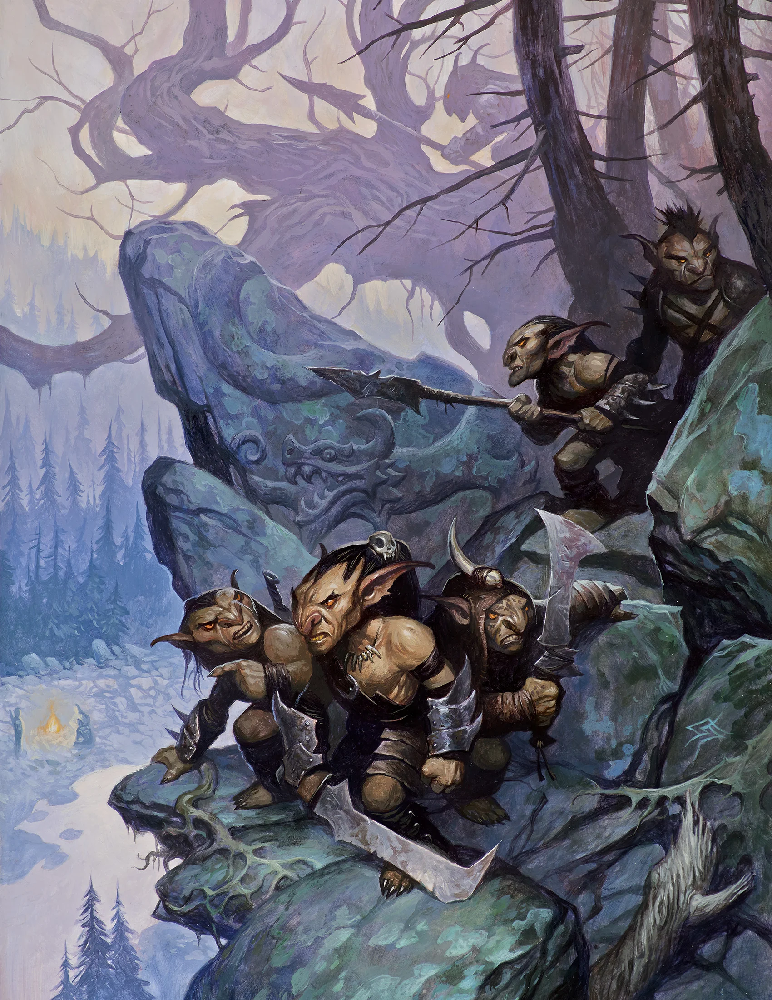

# Session #01
###  *The Adventure Begins... Goblin Ambush!*

After agreeing to accompany a supply wagon from [Neverwinter](../../locations/neverwinter.md) to [Phandalin](../../locations/phandalin.md) for [Gundren Rockseeker](../../npcs/gundren-rockseeker.md), our brave group of adventurers set forth on a southbound trail… Little do they know that a band of caravan-robbing goblins called the [Cragmaw](../../npcs/cragmaw-goblins.md) are waiting to ambush the party en route. Luckily, the adventurers survive two separate attempts to raid the wagon and even manage to capture a cowardly goblin as it attempts to flee the encounter.

After interrogating the goblin at length, the party learns that the Cragmaw have a nearby hideout and set off to find where [Sildar Hallwinter](../../npcs/sildar-hallwinter.md), Gundren Rockseeker’s human bodyguard, has be taken to. Dodging several hastily laid traps, our heroes found themselves at the mouth of a massive cave and the sun quickly setting.

