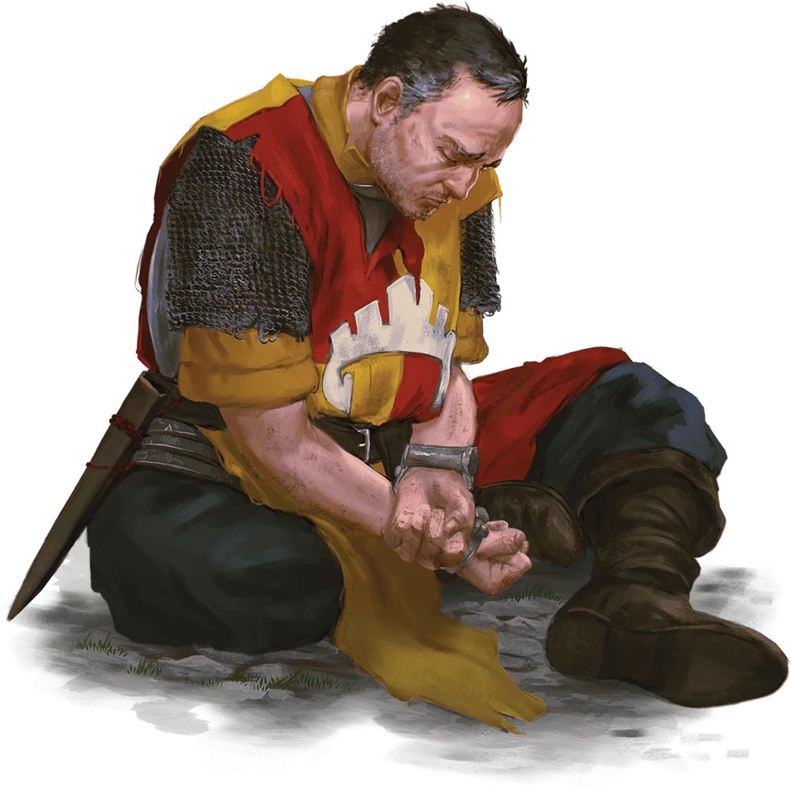

# NPC: Sildar Hallwinter

Middle-aged, human bodyguard to [Gundren Rockseeker](./gundren-rockseeker.md). Currently held hostage by goblins of the Cragmaw tribe.

## DM Only
<em><strong>Stat Block</strong></em>
| STR | DEX | CON | INT | WIS | CHA |
| :---: | :---: | :---: | :---: | :---: | :---: |
| 13 _(+1)_ | 10 _(+0)_ | 12 _(+1)_ | 10 _(+0)_ | 11 _(+0)_ | 10 _(+0)_ |

    
<em><strong>Roleplaying Sildar</strong></em>

Sildar is a kindhearted human man of nearly fifty years who holds a place of honor in the famous griffon cavalry of Waterdeep. He is an agent of the Lords' Alliance, a group of allied political powers along the Sword Coast concerned with mutual security and prosperity. The order ensures the safety of the cities and other settlements of Faerûn by proactively handling violent threats, and order members work to bring honor and glory to their leaders and their homeland.  

Sildar met Gundren Rockseeker in Neverwinter and agreed to accompany him to Phandalin. Sildar wants to investigate the disappearance of Iarno Albrek, a human wizard and fellow member of the Lords' Alliance, who disappeared shortly after arriving in Phandalin. Sildar hopes to learn what happened to Iarno, assist Gundren in reopening the old mine, and help restore Phandalin to a center of wealth and prosperity.  

    
<em><strong>Voice</strong></em>

Use David Wenham's portrayal of [Dilios from "300"](https://www.youtube.com/watch?v=Qsma7OGcp6A) as an archetype.

**Sildar provides the characters with the following useful information:**

<em><strong>A Missing Wizard</strong></em>

Iarno Albrek, a human wizard, was Sildar's contact in Phandalin. The wizard traveled to the town several months ago to try to establish order there. After the Lords' Alliance didn't hear from Iarno, Sildar decided to investigate.  

<em><strong>Wave Echo Cave</strong></em>

The three Rockseeker brothers <em>(Gundren, Tharden, and Nundro)</em> recently located an entrance to the long-lost Wave Echo Cave, site of the mines of the Phandelver Pact. <em>(Share the information in the first two paragraphs of this chapter with the players at this time. The characters won't know yet, but Tharden is dead and Nundro is a prisoner in the mine.)</em>  

<em><strong>The Mysterious Spider</strong></em>

Klarg, the bugbear who leads this goblin band, had orders to waylay Gundren. Sildar heard from the goblins that <em>"the Spider"</em> sent word that the dwarf was to be brought to him. Sildar doesn't know who or what the Spider is.  

<em><strong>Finding Cragmaw Castle</strong></em>

Gundren had a map showing the secret location of Wave Echo Cave, but the goblins took it when they captured him. Sildar believes Klarg sent the map and the dwarf to the leader of the Cragmaws at a place called Cragmaw Castle. Sildar doesn't know where that might be but suggests someone in Phandalin might know. <em>(It doesn't occur to Sildar immediately, but a captured goblin might also be persuaded to divulge the castle's location.)</em>  

<em><strong>Strange Goblin</strong></em>

A strange goblin with an elongated head was with the Cragmaw band that waylaid Sildar. The goblin gave Sildar a bad feeling, but the Cragmaws didn't seem to know the creature. The goblin whispered "you're not what Ruxithid wants" to Sildar before leaving the Cragmaw ambush group. <em>(This is a reference to the psionic goblins that factor more prominently into later chapters.)</em>  

<em><strong>Escort to Phandalin</strong></em>

Sildar tells the characters that he intends to continue to Phandalin, since it's the nearest settlement. He offers to pay the party 50 gp to escort him. Although he has no money on him, Sildar can secure a loan to pay the characters within a day of arriving in Phandalin. He hopes they'll first put a stop to the goblin raids by clearing out the caves.  

